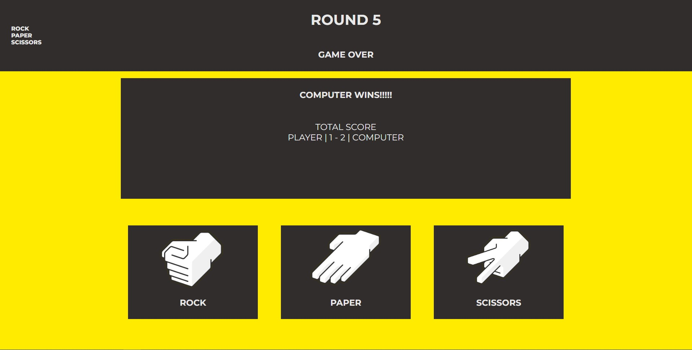

# rps_game
https://blcktitan.github.io/rps_game/

Rock paper scissors game project for Brainnest program

### The challenge

Users should be able to:

- Choose if the want to begin
- Compete five rounds against the computer
- See the winner of each round
- See the overall winner at the end of five rounds
- Choose if the want to play a new game at the end of the contest

### Screenshot

- Solution URL: [https://blcktitan.github.io/rps_game/]
- Live Site URL: [Ahttps://blcktitan.github.io/rps_game/]

### Built with

- Semantic HTML5 markup
- CSS custom properties
- Flexbox
- CSS Grid
- Mobile-first workflow

## Author

- Website - [Ugorji E. Victor](https://blcktitan.github.io/Eze-Portfolio/)
